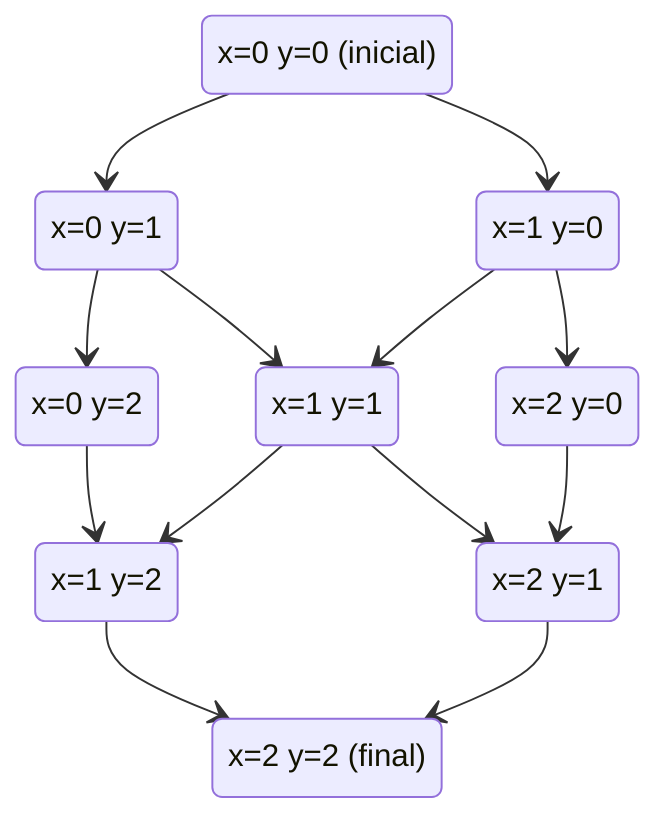

```mermaid
stateDiagram

  

[*]: x=0 y=0 (inicial)

a: x=1 y=0

b: x=2 y=0

c: x=2 y=1

d: x=2 y=2 (final)

e: x=0 y=1

f: x=0 y=2

g: x=1 y=1

h: x=1 y=2

  

[*] --> a

[*] --> e

e --> f

f --> h

h --> d

e --> g

g --> h

g --> c

a --> b

a --> g

b --> c

c --> d
```

Site de exemplos: https://mermaid.js.org/syntax/classDiagram.html
